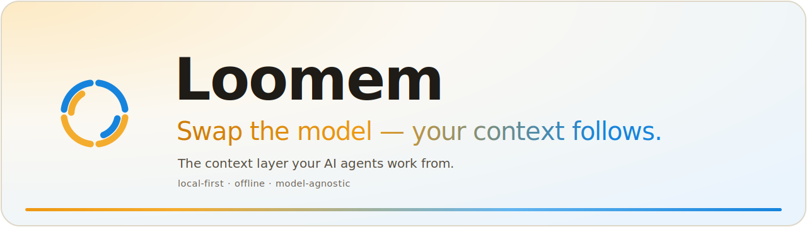

<div align="center">



<br>

[](https://vvooki-sys.github.io/loomem/)
[](LICENSE)
[](https://www.rust-lang.org)
[](https://modelcontextprotocol.io)
[](#)

**[Website](https://vvooki-sys.github.io/loomem/)** · **[Quickstart](#quickstart)** · **[Install](#install)** · **[Architecture](#architecture)** · **[Docs](#documentation)**

</div>

---

Loomem is the open-source context layer for your LLM agents — a single Rust binary on your laptop, served over MCP, that feeds Claude, ChatGPT, Codex, or any MCP client the facts, decisions, and history they need to do real work for you. Swap the model, switch the tool; your context follows.

Loomem stores structured knowledge extracted from conversations, and serves it back to any MCP-capable client (Claude, ChatGPT, Codex, Cursor, your own agents) through hybrid retrieval:

- **Hybrid search** — BM25 (Tantivy) + vector embeddings + entity graph signals, fused with reciprocal-rank fusion.
- **Consolidation** — background workers merge related facts, resolve contradictions, and let stale ones decay ("dreaming").
- **Bitemporal model** — facts carry both ingestion time and event time (`valid_from` / `valid_until`), so "what did I know in March" and "what happened in March" are different queries.
- **Entity graph** — people, projects, and technologies are extracted into a graph with aliases and relations, used both for retrieval and exploration.
- **MCP-native** — 14 `memory_*` tools over the standard MCP HTTP transport, including OAuth dynamic client registration for remote connectors.
- **Encryption at rest** (optional) — field-level AES-GCM envelope encryption with a master key from the environment.

Built in Rust on RocksDB + Tantivy. Single binary, no external services required.

> **Status: early.** The engine has been in daily personal use for a while, but the public API and storage format may still change. Expect rough edges; issues and PRs are welcome.

## Quickstart

From nothing to Claude remembering things across conversations, on macOS or Linux. Each step is independent — run them in order.

**1. Install the binaries** (no sudo; lands in `~/.loomem`):

```bash
curl -fsSL https://raw.githubusercontent.com/vvooki-sys/loomem/main/install.sh | sh
```

**2. Put `~/.loomem/bin` on your PATH** (the installer prints this too):

```bash
echo 'export PATH="$HOME/.loomem/bin:$PATH"' >> ~/.zshrc   # or ~/.bashrc
exec $SHELL
```

**3. Start the server** (config is already seeded in `~/.loomem`):

```bash
cd ~/.loomem && loomem-server
```

**4. Check it's alive** (in another terminal):

```bash
curl http://localhost:3030/health
# {"status":"ok","version":"0.2.0"}
```

> The installer uses port **3030** by default and asks for an alternative if it's already taken (set `LOOMEM_PORT` to skip the prompt). If you picked a different port, use it in the commands below.

**5. Connect Claude Code:**

```bash
claude mcp add --transport http loomem http://localhost:3030/mcp
```

**5b. Using the Claude desktop app (or Cowork) instead?** It connects to local servers over stdio, not HTTP, so bridge it in `claude_desktop_config.json`, then restart Claude. Native, no Node (Loomem ≥ v0.2.1):

```json
{ "mcpServers": { "loomem": { "command": "/absolute/path/to/.loomem/bin/loomem-cli", "args": ["mcp-stdio", "--url", "http://127.0.0.1:3030"] } } }
```

(Any version, needs Node: `"command": "npx", "args": ["-y", "mcp-remote", "http://127.0.0.1:3030/mcp", "--allow-http"]`.) See [Connect an MCP client](#connect-an-mcp-client) for auth and details.

**6. Try it.** In Claude: *"Remember that I prefer dark mode in all my tools."* Then, in a fresh conversation: *"What do you know about my preferences?"* — the answer comes back from Loomem.

Other clients (claude.ai, ChatGPT, OpenClaw), TLS/remote exposure, and the full options matrix are below and in [docs/installation.md](docs/installation.md).

## Install

### One-liner (prebuilt binaries, macOS + Linux)

```bash
curl -fsSL https://raw.githubusercontent.com/vvooki-sys/loomem/main/install.sh | sh
```

Installs `loomem-server`, `loomem-cli`, and `loomem-migrate` to `~/.loomem/bin` (no sudo) and drops config templates into `~/.loomem`. Pin a version with `LOOMEM_VERSION=v0.2.0`, change the location with `LOOMEM_INSTALL_DIR`. Archives are verified against `SHA256SUMS` from the [releases page](https://github.com/vvooki-sys/loomem/releases).

**Full guide** — requirements, version pinning, manual checksum verification, upgrading, uninstalling, troubleshooting: [docs/installation.md](docs/installation.md).

### From source

```bash
git clone https://github.com/vvooki-sys/loomem.git
cd loomem
cp entities.toml.example entities.toml   # personal entity config (gitignored)
cargo run --release -p loomem-server
# server listens on http://127.0.0.1:3030, data in ./data
```

Requires Rust (stable) and libclang (for the RocksDB build): `apt install libclang-dev` on Debian/Ubuntu, included with Xcode CLT on macOS.

### Docker

```bash
docker build -t loomem .
docker run -p 3030:3030 -v loomem-data:/data loomem
```

Authentication is off by default for local use. To require an API key, set the env var named in `config.toml` (`server.auth_token_env`, default `LOOMEM_AUTH_TOKEN`) and pass it as `Authorization: Bearer <key>`. **If the server is reachable by anyone but you, set the token.**

## Connect an MCP client

Loomem speaks MCP over streamable HTTP at `/mcp`. Any MCP-capable client works; recipes for the common ones:

### Claude Code

```bash
claude mcp add --transport http loomem http://localhost:3030/mcp
```

### Claude desktop app (and Cowork) — local stdio bridge

The Claude **desktop app** (and Cowork) connect to *local* MCP servers over **stdio**, not HTTP, and the "Add custom connector" box in Settings only accepts an `https://` URL — so you cannot paste `http://localhost:3030/mcp` there. You bridge Loomem's local HTTP endpoint to stdio. Add one of the blocks below to `claude_desktop_config.json` (macOS: `~/Library/Application Support/Claude/claude_desktop_config.json`; Windows: `%APPDATA%\Claude\claude_desktop_config.json`), then fully restart Claude.

**Recommended — native bridge, no Node** (Loomem ≥ v0.2.1; the `loomem-cli` you already installed includes it):

```json
{
  "mcpServers": {
    "loomem": {
      "command": "/absolute/path/to/.loomem/bin/loomem-cli",
      "args": ["mcp-stdio", "--url", "http://127.0.0.1:3030"]
    }
  }
}
```

Use the absolute path to `loomem-cli` (e.g. `/Users/you/.loomem/bin/loomem-cli`) — the desktop app doesn't inherit your shell `PATH`. Add `"--token", "<your token>"` to `args`, or set `LOOMEM_AUTH_TOKEN` in an `"env"` block, if you enabled auth.

**Alternative — `mcp-remote`** (works with any version, needs Node 18+ / `npx`):

```json
{
  "mcpServers": {
    "loomem": {
      "command": "npx",
      "args": ["-y", "mcp-remote", "http://127.0.0.1:3030/mcp", "--allow-http"]
    }
  }
}
```

`--allow-http` is required because the endpoint is plain HTTP on localhost. For auth, append `"--header", "Authorization: Bearer ${LOOMEM_AUTH_TOKEN}"` to `args` and add `"env": { "LOOMEM_AUTH_TOKEN": "<your token>" }`. Either block also works for any other stdio-only desktop client. (Claude **Code** is the exception — it speaks HTTP natively, so use the `claude mcp add` recipe above instead of a bridge.)

### Claude — remote connector (HTTPS, hosted elsewhere)

To connect to a Loomem instance running on another machine, claude.ai/desktop's remote connector talks HTTPS. Expose your instance behind a reverse proxy with TLS (or a tunnel like Cloudflare Tunnel), set `SERVER_ORIGIN=https://your-domain` (required so OAuth metadata advertises the right URL), then add the connector in Claude settings pointing at `https://your-domain/mcp`. Loomem supports OAuth dynamic client registration out of the box (`/.well-known/oauth-authorization-server`).

### ChatGPT — custom connector

ChatGPT requires HTTPS and OAuth for custom connectors (static API keys are not supported); developer mode must be enabled (Pro/Team/Enterprise plans). Expose the server over HTTPS as above, then: ChatGPT → Settings → Connectors → Add custom connector → paste `https://your-domain/mcp` and complete the OAuth flow.

### OpenClaw

```bash
openclaw mcp add loomem --url http://localhost:3030/mcp --transport http \
  --header "Authorization: Bearer $LOOMEM_AUTH_TOKEN"
```

For a remote OpenClaw gateway, point `--url` at your HTTPS endpoint instead.

### Generic MCP client config

```json
{
  "mcpServers": {
    "loomem": {
      "type": "http",
      "url": "http://localhost:3030/mcp",
      "headers": { "Authorization": "Bearer <your LOOMEM_AUTH_TOKEN>" }
    }
  }
}
```

### Standalone server notes

One Loomem instance can serve several clients at once (Claude Code locally, ChatGPT through the HTTPS endpoint, etc.) — they share the same context. Keep the bind address `127.0.0.1` unless you front it with TLS + auth; never expose the bare HTTP port to the internet.

## Architecture

```
                    ┌──────────────────────────────────────────────┐
                    │                loomem-server                 │
 MCP client ──────► │  /mcp (JSON-RPC) ── dispatcher ─┐            │
 HTTP client ─────► │  /v1/* + /api/* ─── handlers ───┤            │
                    └─────────────────────────────────┼────────────┘
                                                      ▼
                    ┌──────────────────────────────────────────────┐
                    │                 loomem-core                  │
                    │  hybrid search (BM25 + vector + graph + RRF) │
                    │  consolidation / decay / dream workers       │
                    │  entity extraction + alias graph             │
                    │  encryption at rest (optional)               │
                    └───────┬───────────────┬──────────────────────┘
                            ▼               ▼
                       RocksDB          Tantivy
                  (chunks, graph,    (full-text index)
                   embeddings)
```

Workspace crates: `loomem-core` (engine), `loomem-server` (HTTP/MCP server), `loomem-migrate` (offline DB maintenance), `loomem-cli` (command-line client).

## Documentation

- [Quick start](docs/QUICK_START.md)
- [Configuration](docs/configuration.md)
- [API reference](docs/api-reference.md)
- [MCP tools](docs/mcp-tools.md)
- [Architecture](docs/architecture.md)
- [Deployment](docs/deployment.md)
- [Security model](docs/SECURITY.md)
- [Backup & restore](docs/backup-and-restore.md)

## FAQ

**What is Loomem?**
The open-source context layer for LLM agents. Written in Rust, it runs as a single binary on RocksDB and Tantivy and is served over the Model Context Protocol (MCP). It gives Claude, ChatGPT, Codex, or any MCP client the facts, decisions, and history they need to do real work for you — portable, local-first, and yours.

**How is Loomem different from mem0, Zep, Letta, and cognee?**
Loomem ships as a single Rust binary with no external services — most alternatives need a separate vector and/or graph database. It leads on context ownership and portability, runs fully self-hosted and local-first, supports offline embeddings via local ONNX models, and is MCP-native out of the box.

**Is Loomem free and open source?**
Yes — Apache-2.0, free to self-host. Source is in this repository.

**Does Loomem require an internet connection or OpenAI?**
No internet is required for core use. Embeddings can run on-device with a local ONNX model, and storing and searching context works fully offline. An OpenAI API key is optional and only enhances LLM-based consolidation, extraction, and contradiction detection; without it those steps fall back to regex.

**Which LLM clients can connect?**
Any MCP-capable client. Loomem speaks MCP over streamable HTTP and provides recipes for Claude, Claude Code, ChatGPT, Codex, and Cursor, plus OAuth dynamic client registration for remote connectors.

**Why not just use ChatGPT or Claude built-in memory?**
Built-in memory is locked to one vendor. Loomem keeps your context portable across every tool and model, self-hosted and owned by you, with a structured entity graph and bitemporal history a single vendor's feature doesn't give you.

## License

Apache-2.0. See [LICENSE](LICENSE).
